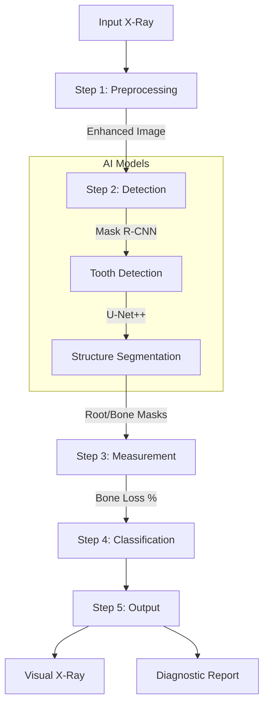

# Automated Tooth Strength Analysis System

## Overview
This project is an automated dental diagnostic system that processes panoramic X-rays to assess tooth strength and detect periodontitis. It follows a structured 5-step pipeline using computer vision and deep learning.

## Methodology



### Step 1: Preprocessing
Enhances raw X-ray images for better analysis:
*   **Noise Removal**: Gaussian Blur.
*   **Contrast Enhancement**: CLAHE (Contrast Limited Adaptive Histogram Equalization).
*   **Edge Sharpening**: Unsharp Masking.
*   **Image Normalization**: Standardizing pixel intensity ranges.

### Step 2: Detection (AI Models)
Identifies anatomical structures:
*   **Mask R-CNN**: Detects individual teeth (Instance Segmentation).
*   **U-Net++**: Segments the Root, Alveolar Bone, and CEJ (Semantic Segmentation) for each detected tooth.

### Step 3: Measurement
Calculates clinical metrics:
*   **Root Length**: Distance from CEJ to Apex.
*   **Bone Loss**: Distance from CEJ to Alveolar Bone Crest.
*   **Bone Loss %**: `(Bone Loss / Root Length) * 100`.

### Step 4: Classification
Diagnoses condition based on Bone Loss % (AAP Guidelines):
*   **Healthy**: < 15%
*   **Mild Periodontitis**: 15% - 33%
*   **Moderate Periodontitis**: 33% - 50%
*   **Severe Periodontitis**: > 50%

### Step 5: Output
Generates comprehensive results:
*   **Tooth-wise Strength Report**: Strength Score (0-100), Infection Score, Integrity Score.
*   **Visual Marked X-ray**: Overlay of segmentation and key points.
*   **Digital Diagnostic Report**: Clinical diagnosis (e.g., "Severe Periodontitis").

## Technologies
*   **Models**:
    *   **CNN (ResNet backbone)**: Feature extraction.
    *   **Mask R-CNN**: Instance segmentation.
    *   **U-Net++**: Biomedical semantic segmentation.
*   **Software**: Python, PyTorch, OpenCV, NumPy.

## Setup

1.  **Prerequisites:**
    - Python 3.10+
    - CUDA-capable GPU (recommended)

2.  **Installation:**
    ```bash
    python -m venv .venv
    .venv\Scripts\activate
    pip install -r requirements.txt
    ```

3.  **Running the API:**
    ```bash
    uvicorn api.main:app --reload --port 8001
    ```

## Debugging & Visualization
To see the output of each step and the calculation values:

1.  **Run the Debug Pipeline:**
    ```bash
    python debug_pipeline.py --image inputs/00011.jpg
    ```

2.  **View Outputs:**
    Check the `outputs/debug_00011/` directory. It contains:
    *   `01_original.jpg`: Raw input.
    *   `01_preprocessed.jpg`: Enhanced image (Step 1).
    *   `02_detections.jpg`: Detected teeth (Step 2).
    *   `03_tooth_X_crop.jpg`: Individual tooth crops.
    *   `04_tooth_X_mask.jpg`: Segmentation masks (Step 2).
    *   `05_tooth_X_analysis.jpg`: Final marked image with Diagnosis & Scores (Steps 3-5).

3.  **View Calculations:**
    Check the **terminal/console output** while the script runs. It prints:
    *   Detected tooth count.
    *   Per-tooth metrics (Strength, Infection, Integrity).
    *   Diagnosis (e.g., "Severe Periodontitis").

## Directory Structure
- `api/`: FastAPI application and routes.
- `models/`: PyTorch model definitions (Mask R-CNN, U-Net++).
- `services/`: Business logic.
    - `preprocessing.py`: Image enhancement pipeline.
    - `measurement.py`: Geometric analysis.
    - `scoring.py`: Scoring and classification logic.
- `config/`: Configuration settings.
- `tests/`: Unit and integration tests.
